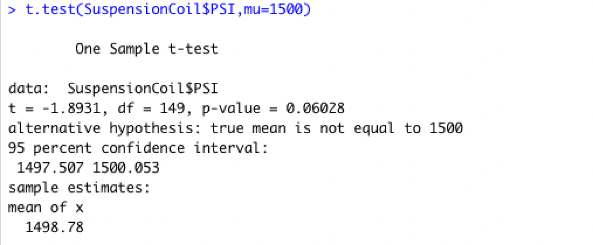
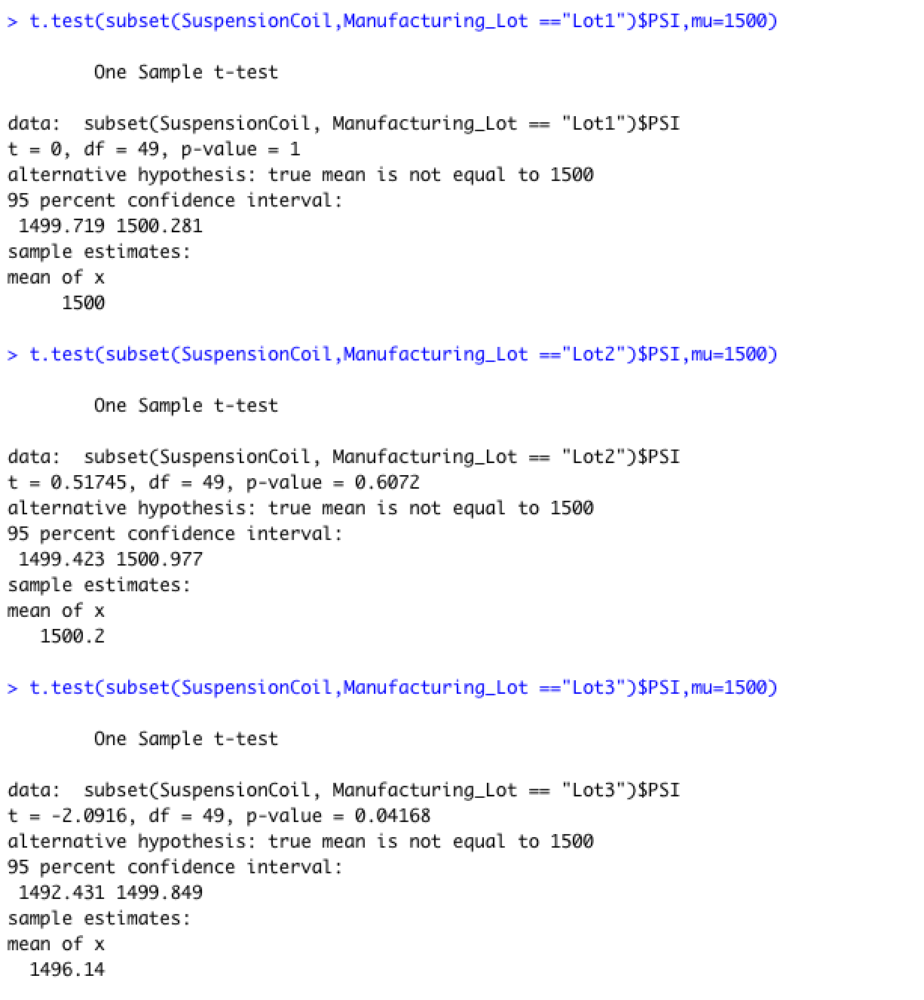

# MechaCar Statistical Analysis

## __Purpose:__

The purpose of this project is to perform statistical analysis on production data for MechaCar, a new model from AutosRUs, which is suffering from production troubles that are affecting manufacturing. Through this analysis, useful information would be provided to the manufacturing team to help manage the production troubles.

## __Analysis:__

## Linear Regression to Predict MPG:
Linear regression and Summary functions were performed on MechaCar's mpg test result data from different prototypes. The data contained multiple metrics such as vehicle length, vehicle weight, spoiler angle, drivetrain, and ground clearance. 

The following screenshot provides the results of the Linear regression and summary functions:

From this analysis, it can be observed that:

- The Vehicle Length and Ground Clearance variables provide a non random amount of variance to the mpg values.

- The p value of our linear regression analysis is 5.35 X 10(to the power of -11).This is much smaller than the significance value of 0.05%. So, we reject the null hypothesis which means the slope of our linear model is not zero.

- This linear model does not effectively predict the mpg of Mechacar prototypes. The reason is, as mentioned above, the variables Vehicle length and Ground Clearance are statistically unlikely to provide random amounts of variance to the linear model. In other words, these variables have a significant impact on the mpg(dependant variable) and cause a significant amount of variability in the dependent variable. This could mean that these variables may need to be transformed or scaled to better help predict the dependent variable. It could also mean that there are other variables that could help explain the variability of the dependant variable(mpg), that have not been included in our model.

## Summary Statistics on Suspension Coils:

The following screenshots display the results of Summary Statistics calculations on the Suspension Coil data:

### Lot Summary

### Total Summary

Per the design specifications, the variance of the suspension coils should not exceed 100 pounds per square inch. According to the Total summary for all manufactruring lots, the variance does not exceed 100 pounds PSI and therefore meets design specifications. But, the lot summary shows that Lot 3 exceeds the recommended variance. So when we look at the lot specific data, while lot 1 and 2 meet the design specifications, lot 3 does not meet the same.

## T-Tests on Suspension Coils

T Tests were performed on Suspension Coil data to  determine if the PSI across all manufacturing lots as well as PSI of each manufacturing lot were statistically different from the population mean of 1500 pounds per square inch. 

Our Hypotheses for these tests are as follows:
H0 : Null Hypothesis: There is no statistical difference between the observed sample mean and its presumed population mean.
Ha : Alternate Hypothesis: There is a statistical difference between the observed sample mean and its presumed population mean.

The results and conclusion of the tests are given below:

### All Lots mean PSI vs Population Mean:

The calculated p-value is 0.06 which is above the significance level of 0.05 and therefore we do not have sufficient evidence to reject the null hypothesis and we can state that both means are statistically similar.
### Mean PSI of each Lot vs Population Mean:

For lot 1, the p-value of 1 is above the significance level of 0.05. Therefore we do not reject the null hypothesis and state that the mean of Lot 1 is statistically similar to the Population mean of 1500.

For lot 2, the p-value of 0.6 is above the significance level of 0.05. Therefore we do not reject the null hypothesis and state that the mean of Lot 2 is statistically similar to the Population mean of 1500.

For lot 3 , the p-value of 0.04 is less than the significance level of 0.05. Therefore we can reject the null hypothesis and state that the mean of Lot 3 is statistically different from the Population mean of 1500.

## Study Design: MechaCar vs Competition.

In order to study the performance of Mechacar against its competition, several metrics can be considered such as :
- Cost
- Fuel Efficiency/ Mileage
- Features
- Performance
- Horsepower
- Maximum Speed 
- Maintenance Cost
- Safety Rating

 Of these, we will take a look at Fuel Efficiency. 
 
 We will assume that the data we have comprises of Fuel Efficiency( Miles per gallon) data for both city and highway of different makes and models of competitors of Mechacar. Besides vehicle details such as vehicle Class, cylinder, Transmission etc., we also details of different factors that affect MPG such as vehicle weight and horsepower.
 
 In order to perform specific analysis, the necessary data can be extracted and placed into new dataframes. To begin with, we will perform the Shapiro Wilk Normality test to ensure that our data is normally distributed in the newly created dataframes.

Further, the statistical tests that can be used for our analysis are:

- One Sample t-test
- Correlation testing
-  Multiple Linear regression 
- One way ANOVA test

### One Sample t-test

For this we can extract a subset of the data where the vehicle model/ make is Mechacar, and calculate the mean MPG and compare the same with the population mean MPG to see if they are significantly different. The following Hypothesis will be tested:

H0 : Null Hypothesis: There is no statistical difference between the observed sample mean MPG of Mechacar and the population mean MPG of all cars.
Ha : Alternate Hypothesis: There is a statistical difference between the observed sample mean MPG of MechaCar and the population mean MPG of all cars.

### Correlation testing

The cor() function can be used to test the Correlation between the vehicle weight and MPG as well as horsepower and MPG.

### Multiple Linear Regression testing

This can be used to study the impact of factors such as vehicle weight and Horsepower on the MPG of the vehicles. Here the hypotheses will be as follows:
H0 : The slope of the linear model is zero, or m = 0

Ha : The slope of the linear model is not zero, or m ≠ 0
When a multiple linear regression model is generated with MPG as the dependent variable and vehicle weight and horsepower as independent variables,the calculated output will show the p value which can be compared with the significance value of 0.05. If the Null Hypothesis is rejected, then the slope of the linear model is not zero which means that there is a significant relationship between our independent and dependent variables.

Also each independent variable's p value can be looked at to determine which one makesa significant contribution to the linear model.

### ANOVA Test:

The ANOVA test could be used to test the mean MPG of vehicles across vehicle class. Here the hypotheses would be as follows:
H0 : The means of all groups are equal, or µ1 = µ2 = … = µn.

Ha : At least one of the means is different from all other groups.
The aov() function can be used to perform this test with MPG as dependent variable and Vehicle Class as Independent variable. If our Null Hypothesis is rejected, it would mean that there is a significant difference in the MPG between atleast one vehicle class and the others.

All these tests would provide useful information for the production team to improve each feature of MechaCar, so that it stands out against the competition.

