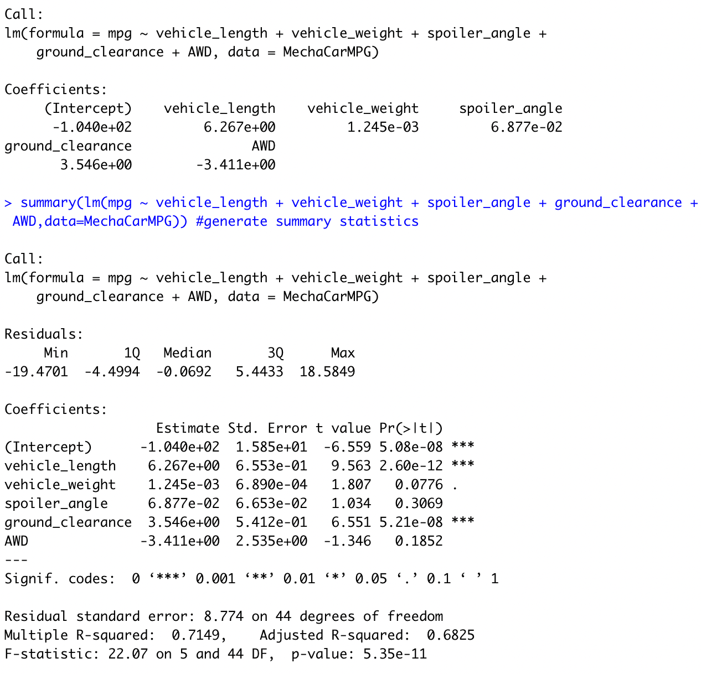
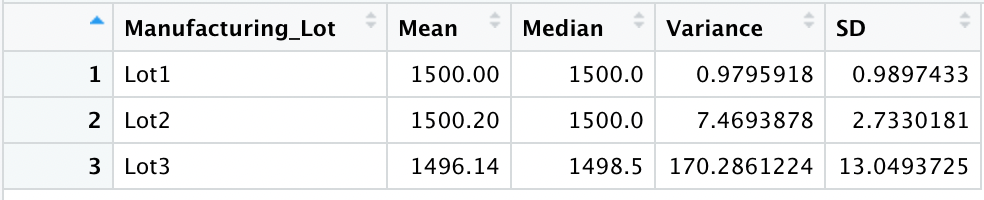

# MechaCar Statistical Analysis

## __Purpose:__

The purpose of this project is to perform statistical analysis on production data for MechaCar, a new model from AutosRUs, which is suffering from production troubles that are affecting manufacturing. Through this analysis, useful information would be provided to the manufacturing team to help manage the production troubles.

## __Analysis:__

## Linear Regression to Predict MPG:
Linear regression and Summary functions were performed on MechaCar's mpg test result data from different prototypes. The data contained multiple metrics such as vehicle length, vehicle weight, spoiler angle, drivetrain, and ground clearance. 

The following screenshot provides the results of the Linear regression and summary functions:

From this analysis, it can be observed that:

- The Vehicle Length and Ground Clearance variables provide a non random amount of variance to the mpg values.

- The p value of our linear regression analysis is 5.35 X 10(to the power of -11).This is much smaller than the significance value of 0.05%. So, we reject the null hypothesis which means the slope of our linear model is not zero.

- This linear model does not effectively predict the mpg of Mechacar prototypes. The reason is, as mentioned above, the variables Vehicle length and Ground Clearance are statistically unlikely to provide random amounts of variance to the linear model. In other words, these variables have a significant impact on the mpg(dependant variable) and cause a significant amount of variability in the dependent variable. This could mean that these variables may need to be transformed or scaled to better help predict the dependent variable. It could also mean that there are other variables that could help explain the variability of the dependant variable(mpg), that have not been included in our model.

## Summary Statistics on Suspension Coils:

The following screenshots display the results of Summary Statistics calculations on the Suspension Coil data:

### Lot Summary

### Total Summary

Per the design specifications, the variance of the suspension coils should not exceed 100 pounds per square inch. According to the Total summary for all manufactruring lots, the variance does not exceed 100 pounds PSI and therefore meets design specifications. But, the lot summary shows that Lot 3 exceeds the recommended variance. So when we look at the lot specific data, while lot 1 and 2 meet the design specifications, lot 3 does not meet the same.

